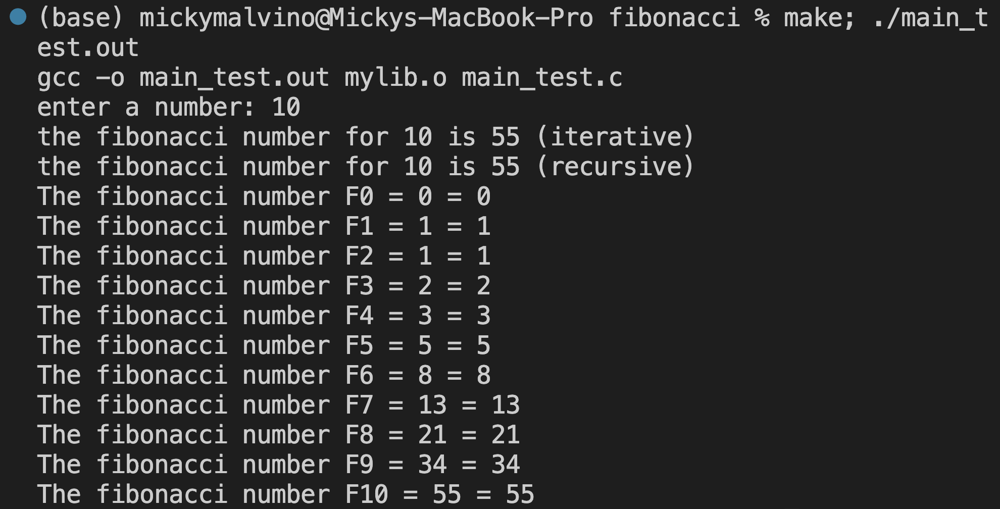

# Fibonacci Benchmark
The Fibonacci sequence is a set of integers (the Fibonacci numbers) that starts with a zero, followed by a one, then by another one, and then by a series of steadily increasing numbers. The sequence follows the rule that each number is equal to the sum of the preceding two numbers.


**There's two ways we're gonna test out fibonacci sequence, using:** 
* iterative method 

```
int fibonacciIterative(int N){
    int num1 = 0, num2 = 1, numN;
    if (N==0){
        return num1;
    } else if(N==1){
        return num2;
    } else{
        for (int i = 2; i <= N; i++){
            numN = num1 + num2;
            num1 = num2;
            num2 = numN; 
        }
        return numN;
    }
}

```
* recursive method

```
int fibonacciRecursive(int N){
    if (N==0){
        return 0;
    } else if (N==1){
        return 1;
    } else{
        return fibonacciRecursive(N-1) + fibonacciRecursive(N-2);
    }
}
```

## Test
Let's test if the code works. To do this we type the following in terminal:

```
make; ./main_test.out
```


## Benchmark
We find out about the time and space complexity of iterative and recursive and compare between them

### Time Complexity
We type down the following code in the terminal:
```
make time
```


### Space Complexity
We type down the following code in the terminal for iterative and then we check the activity monitor:
```
make space
./main_b_space_iterative.out
```


We type down the following code in the terminal for recursive and then we check the activity monitor:

```
make space
./main_b_space_recursive.out
```


## Conclusion
1. Iterative = Less time complexity, Less space complexity
2. Recursive = More time complexity, More space complexity
---
*We can therefore say iterative is more effective than recursive in this case using fibonacci.*
